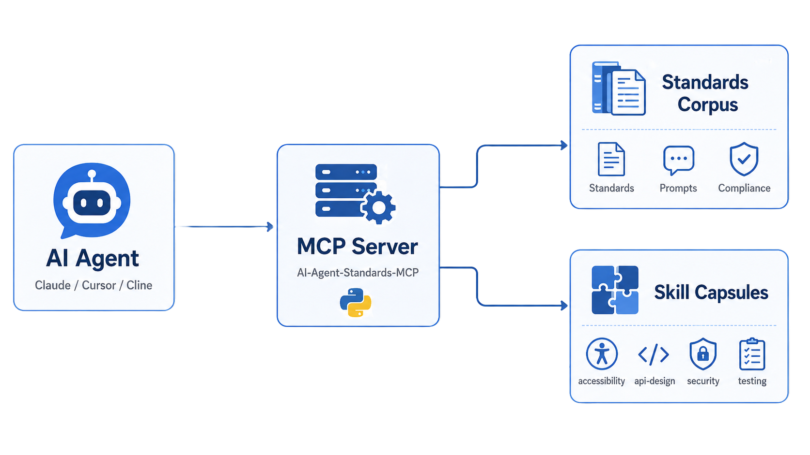

# AI Agent Standards MCP (v3.0.0)

[](https://www.python.org/)
[](https://opensource.org/licenses/MIT)
[](https://modelcontextprotocol.io/)
[](#development)

MCP server phục vụ bộ chuẩn AI Agent Coding Standards và skill set v3.0.0 qua giao thức **Stdio** (không cần HTTP).



---

## Install

**Automatic (recommended):**
```bash
python3 scripts/install-mcp.py        # Linux / macOS
python  scripts/install-mcp.py        # Windows
```

**Manual:**
```bash
python -m venv .venv
.venv/bin/pip install -e ".[dev]"     # Linux / macOS
.venv\Scripts\pip install -e ".[dev]" # Windows
```

---

## MCP Client Config

Add to your MCP client config (Claude Desktop, VS Code, Cursor…):

**Linux / macOS**
```json
{
  "mcpServers": {
    "ai-agent-standards-mcp": {
      "command": "/absolute/path/to/repo/.venv/bin/python",
      "args": ["-m", "ai_agent_standards_mcp"],
      "env": { "PYTHONPATH": "/absolute/path/to/repo/src" }
    }
  }
}
```

**Windows**
```json
{
  "mcpServers": {
    "ai-agent-standards-mcp": {
      "command": "C:\\absolute\\path\\to\\repo\\.venv\\Scripts\\python.exe",
      "args": ["-m", "ai_agent_standards_mcp"],
      "env": { "PYTHONPATH": "C:\\absolute\\path\\to\\repo\\src" }
    }
  }
}
```

> [!TIP]
> Để trỏ server sang một thư mục standards khác, set biến môi trường:
> `AI_AGENT_STANDARDS_ROOT=/path/to/AI-Agent-Standards`

---

## Quick Example

Test nhanh với MCP Inspector:
```bash
npx @modelcontextprotocol/inspector .venv/bin/python -m ai_agent_standards_mcp
```
Mở URL in ra (thường là `http://localhost:5173`) để gọi thử các tools và xem prompts.

---

## MCP Surface

### Tools
| Tool | Description |
|---|---|
| `list_entries(category, kind)` | Liệt kê toàn bộ nội dung đã index |
| `get_entry(identifier)` | Lấy nội dung theo slug / tên skill / path |
| `search_entries(query, limit, kind)` | Tìm kiếm theo từ khoá |
| `recommend_context(task, limit)` | Gợi ý standards & skills phù hợp với task |

### Prompts (Slash Commands)
| Prompt | AWF Command | Mô tả |
|---|---|---|
| `apply_standards` | – | Sinh work prompt chuẩn hoá |
| `review_ai_code` | – | Review code theo framework |
| `init` | `/init` | Khởi tạo project mới |
| `plan` | `/plan` | Lên kế hoạch tính năng |
| `design` | `/design` | Kiến trúc kỹ thuật |
| `visualize` | `/visualize` | Mockup UI/UX |
| `code` | `/code` | Triển khai code chất lượng cao |
| `run` | `/run` | Kiểm tra môi trường chạy |
| `test` | `/test` | Viết và chạy test |
| `deploy` | `/deploy` | Kiểm tra an toàn trước khi deploy |
| `debug` | `/debug` | Debug có hệ thống |
| `refactor` | `/refactor` | Refactor an toàn |
| `audit` | `/audit` | Audit bảo mật & sức khoẻ |
| `rollback` | `/rollback` | Rollback khẩn cấp |
| `recap` | `/recap` | Khôi phục context workspace |

### Resources
- `standards://manifest` — JSON catalog tổng quan
- `standards://document/{slug}` — Tài liệu standards / framework
- `standards://skill/{name}` — Skill capsule theo yêu cầu

---

## Project Tree

```
AI-Agent-Standards-mcp/
├── ai-agent-standards/          # Corpus chuẩn hoá chính
│   ├── compliance/              # Checklist tuân thủ (A11Y, COMPLIANCE)
│   ├── engineering-practices/   # Docs, testing, release process
│   ├── multi-agent/             # Prompt cho từng vai trò agent
│   ├── onboarding/              # Hướng dẫn cho agent mới
│   ├── principles/              # Karpathy framework
│   ├── prompts/                 # Template prompt & sample use-cases
│   ├── quality-control/         # Checklist review, CI/CD gates
│   ├── reference/               # Glossary, error reference
│   ├── risk-management/         # Security, escalation, failure log
│   ├── CHANGELOG.md
│   └── INDEX.md
├── docs/
│   ├── images/                  # Ảnh tài liệu (architecture-flowchart.png)
│   ├── SKILLS_OVERVIEW.md       # Danh sách tất cả skills (auto-generated)
│   ├── repo-map-for-agents.md
│   └── rules-generation.md
├── karpathy/                    # Nguyên tắc gốc từ Karpathy
├── scripts/
│   ├── generate-skills-overview.py
│   ├── install-mcp.py
│   ├── run-mcp.cmd / .ps1 / .sh / .py
├── skills/                      # Skill capsules (mỗi thư mục = 1 skill)
│   └── <skill-name>/SKILL.md
├── src/ai_agent_standards_mcp/  # Source code MCP server
│   ├── server.py                # FastMCP server & tool/prompt definitions
│   ├── catalog.py               # Logic index & tìm kiếm nội dung
│   ├── paths.py                 # Phát hiện đường dẫn corpus
│   ├── text.py                  # Tiện ích xử lý văn bản
│   └── __main__.py              # Entry point
├── tests/                       # Unit tests
├── LICENSE
├── PROJECT-STANDARDS.md         # Chuẩn riêng của project (tuỳ chỉnh)
├── pyproject.toml
├── README.md
└── SKILL-REFERENCE.md           # Tham chiếu nhanh toàn bộ skills
```

---

## Development

```bash
python -m pytest
```

Test suite bao gồm: catalog discovery, lookup, search, và task-context recommendation — không cần khởi động MCP client.
